# Weather Prediction using LSTM
**Built many Weather Prediction models. The models predicts the temperature high of a given day in Boston, MA using historical weather data.** 

Note: ChatGPT and DeepSeek were utilized to outline the initial code structure as well as help with wording in README, help create some graphs, and help with some bugs encountered.

## Dataset
- Used weather data from the **National Oceanic and Atmospheric Administration (NOAA)** for training and testing.
- The station used is **Boston Logan International airport in Boston, Massachusetts, US**
- **The initial training and testing data begins on 1/1/2020 and ends on 3/5/2025.**
- The notable data included in the CSV from NOAA includes: 
    - AWND (Average daily wind speed in mph)
    - PRCP (precipitation in inches)
    - SNOW (snowfall in inches)
    - TAVG (Average Temperature in Fahrenheit)
    - TMIN (Min Temperature in Fahrenhiet)
    - TMAX (Max Temperature in Fahrenheit)
    - Weather types. There are 9 different weather types, but only 8 are of note for this data.         
        - WT01 is fog, ice fog, or freezing fog (may include heavy fog). 
        - WT02 is heavy fog or heaving freezing fog (not always distinguished from fog). 
        - WT03 is thunder.
        - WT04 is ice pellets, sleet, snow pellets, or small hail
        - WT05 is hail
        - WT06 is glaze or rime
        - WT08 is smoke or haze
        - WT09 is blowing or drifting snow

## Models Explored
For this project, we explored **Long Short-Term Memory (LSTM), a Vanilla Recurrent Neural Network (RNN), and a Simple Sine Predictor**.

First, we trained the models. Then, we explored how they would do on more recent data (3/6/2025 - 3/15/2025).

Below, we will first go over the models explored and training results. Then at the end, we will compare how they all did on predicting the more recent data.

Additionally, for the LSTM, we explored **autoregressing**.

## Long Short-Term Memory (LSTM)
- LSTMs are a type of Recurrent Neural Network (RNN) designed to handle long-term dependencies in sequential data. Unlike traditional RNNs, which struggle with retaining information over long sequences, LSTMs can remember important information for extended periods. This makes them particularly useful for time-series forceasting, such as weather prediction.
- After reviewing [PyTorch LSTM tutorial](https://pytorch.org/tutorials/beginner/nlp/sequence_models_tutorial.html) and [GeeksForGeeks LSTM Tutorial](https://www.geeksforgeeks.org/long-short-term-memory-networks-using-pytorch/), used ChatGPT to create the inital code structure including the LSTM model, preparing the data outline, and training outline.

**Implementation**
- The model can be found in **LSTM/WeatherLSTM.py**
- The code used for training can be found in **train.py**
    - The only thing to note is the preparing data
        - We perform some data cleaning to prevent NaN errors
        - We also use MinMaxScaler to scale the data. This is a common practice for neural networks. We scale our data to be between -1 and 1.

### Experiments
**1. Initial Experimentation**
- The code for this experiment can be found in **LSTM/LSTM_Initial_Experiment_config.py**
- In this design, there are several parameters that can be adjusted as well as aspects of the architecture design.
- There are 5 key parameters that were customized in the initial experiment:
    - **Input Data**: The data fed into the model could either be just the TMAX data or a combination of multiple data points (TMAX, AWND, TAVG, TMIN, WT01...WT09).
    - **Sequence Length**: This refers to the number of time steps in an input sequence that the LSTM processes at once. For example, if the sequence length is 10, the model uses the past 10 days of data to predict the temperature high for the next day. Sequence lengths ranged from 5 to 10 to 30.
    - **Hidden Size**: This represents the number of neurons or features in the hidden state of each LSTM cell. Hidden size values ranged from 50 to 100 to 150.
    - **Number of Layers**: This is the number of stacked layers in the LSTM model. The values varied from 2 to 6 to 10.
    - **Epochs**: This is the number of epochs used during training. Epoch values ranged from 100 to 200."
- In total, there are **108 different configurations explored**. For each experiment, the following details were recorded: the model configuration (as described in the previous section), the final training loss (MSE), the final validation loss (MSE), the test loss (MSE), the test loss (MAE), and information about the worst prediction. The worst prediction was analyzed to check for any overlap or patterns. Please note the losses use the scaled data.
- To analyze performance, the top 5 configurations with the lowest test loss (MSE) were selected for further evaluation. Below are the details of these configurations:

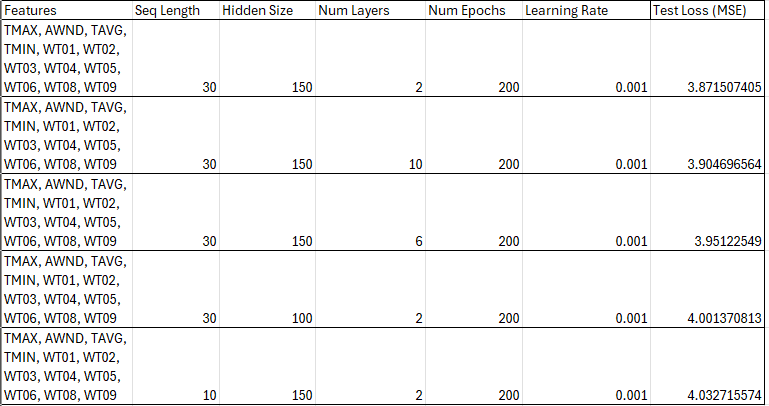

- Here is an image showing the performance of the best performing configuration. We are plotting the LSTM's predictions against the actual high temperature in Boston.

**2. Second Experimentation**
- Code for this can be found in **LSTM/LSTM_Second_Experiment_config.py**
- Based on the above results, a second experiment began using the insight of the above structures to see if an even better structure could be found.
- Here are the parameter details for this experiment.
    - **Input Data**: The only data fed into the model was all of the data above (TMAX, AWND, TAVG, TMIN, WT01...WT09)
    - **Sequence Length**: Varies from 10 to 30 to 40
    - **Hidden Size**: Varies from 100 to 150
    - **Number of Layers**: Varies from 2 to 6 to 10.
    - **Epochs**: Varies from 200 to 250 to 300.
-  In total, there are **54 different configurations explored**. The same information was recorded as the initial experiment.
- To analyze performance, the top 5 configurations with the lowest test loss (MSE) were selected for further evaluation. Below are the details of these configurations:

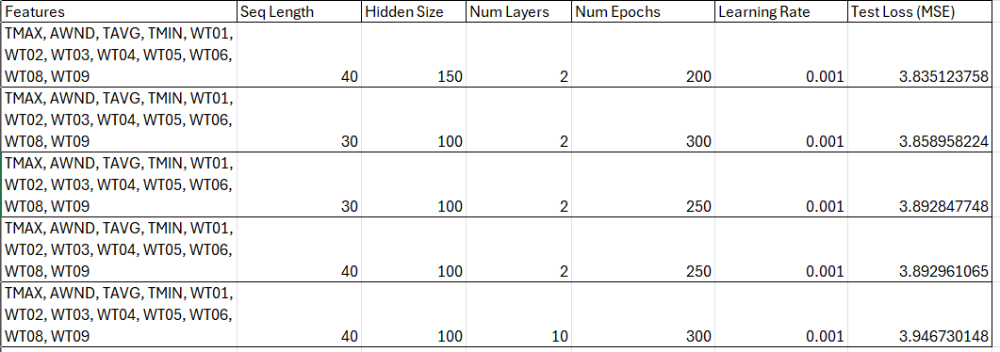

- Here is an image showing the performance of the best performing configuration. We are plotting the LSTM's predictions against the actual high temperature in Boston.

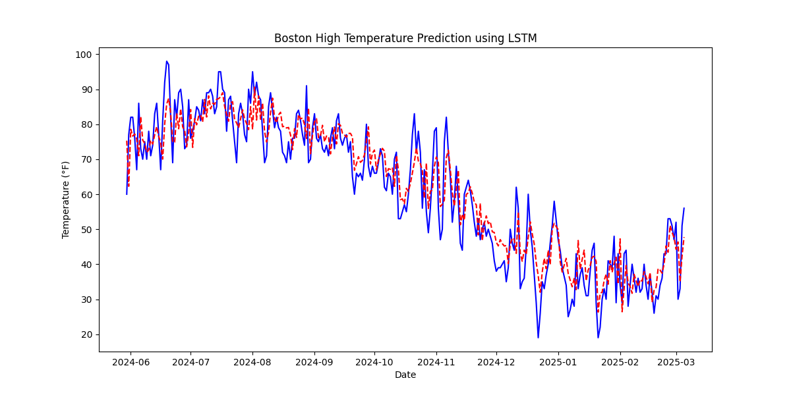

### Analysis of Experiments
**Analysis of the Initial Experiment**
- As noted, there were 108 different configurations explored. We determined the top 5 performing configurations by the test loss. It is important to note that the top 5 configurations also had the top 5 lowest training loss. 
- As can be seen the best performing configuration has a test loss of 3.87 and even the fifth best configuration has a test loss of 4.03 which are very low test loss values given that Mean Squared Error is used.
- Looking at the graph showing the acual temperature high vs the predicted temperature high in Boston, MA. We can see that the LSTM does well in general except for days with a large change in weather which is to be expected.
- **Findings**
    - The input data for the top 5 best configurations are all TMAX, AWND, TAVG, TMIN, WT01...WT09, and none are just TMAX. Thus, it seems that the extra information helps the model better predict the next day's temperature.
    - All of the top 5 best configurations have sequence length of 30 possibly indicating that higher sequences could result in better performance.
    - All of the top 5 best configurations have hidden sizes of 100 or 150, none are 50, suggesting that 100 or 150 could result in better performance.
    - All of the top 5 best configurations have 200 epochs which suggest that higher epochs could result in better performance. 

**Analysis of the Second Experiment**
- As noted, there were 54 different configurations explored. We determined the top 5 performing configurations by the test loss. In this case the top 5 best configurations did not also have the top 5 lowest training loss which could indicate other configurations were overfitting more to the training data.
- This experiment was specifically designed to find a better configuration given the findings above. 
- As can be seen the best performing configuration has a test loss of 3.84. When compared to the initial experiment, where the test loss was already relatively low, it's not surprising that the new configuration does not significantly outperform the previous one. Overall, the experiments were both able to find 5 well performing configurations with very little difference.
- The biggest difference in the experiments is that overall the average test loss of the initial experiment (48.89) is much larger than the average test loss of the second experiment (4.48) which is to be expected. 
- Looking at the graph showing the actual temperature high vs the predicted temperature high in Boston, MA, similar to the initial experiment's best configuration, we can see that the LSTM does well in general except for days with a large change in temperature which is to be expected.

## LSTM Autoregression
LSTM (Long Short-Term Memory) autoregression is a type of recurrent neural network (RNN) architecture used for time series forecasting. It leverages the ability of LSTMs to capture long-term dependencies in sequential data, making it well-suited for tasks like weather prediction.

Here, we are giving it the past 40 day of weather information (TMAX, AWND, TAVG, TMIN, WT01...WT09) for each day. Given that information, we had the models predict the weather forecast for 3/6/2025-3/15/2025 without giving it any information about this time frame.
The model has to use its predictions as input for the next day. 

We explored two different methods here. 

**Model Unchanged**

The code for this config can be found in **LSTM\LSTM_Recent_Data_AutoRegress.py**

For this method, we uses the same exact model (with best performing configuration show above). However, a challenge with our original setup is that the model has a single output for TMAX, however for input, it expects 12 different input columns for a given day with this configuration. 

Once we make a prediction, we will use that prediction as input for forecasting the following day.
Let the sequence length be 4. To predict 3/6/2025, we use data from 3/2/2025 to 3/5/2025. For the next day's prediction, we update the input by removing 3/2/2025 and incorporating our predicted value for 3/6/2025, forming a new sequence from 3/3/2025 to 3/6/2025.
Thus, in this approach, we will use the predicted TMAX value and 0 for the other 11 columns to represent 3/6/2025 which is a limitation of this approach.

We can see the results below:

**Predicted:** [51.24871984, 41.71039946, 43.90613064, 45.25460228, 46.69259459, 48.10362354, 49.34238493, 50.36220714, 51.17900245, 51.83144644]

**Actual:** [56, 43, 41, 46, 62, 62, 50, 44, 46, 62]

**MSE:**  63.17965700256981

As we can see, it does well in general except for days we saw a large change of weather. This is a expected result as these were sudden weather changes.

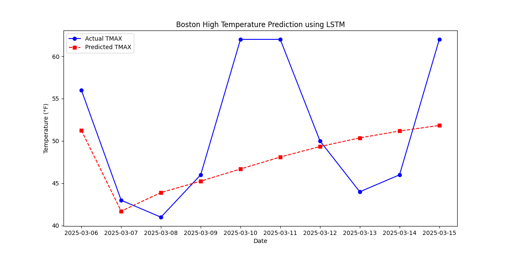

**Model Changed**

The code for this config can be found in **LSTM\LSTM_Recent_Data_AutoRegress_Model_Change.py**

In this case to avoid passing in all 0s for non TMAX values as input to the model, we change the model output to be 12 and not one. However a drawback of this is that the model will try to predict all 12 features not just TMAX.

In this case, once the model makes a prediction, for the next day following the prediction, we will modify the input as described above and add the output of the predicted day. 

Here are the results:

**Predicted:** [45.13398536, 44.73186053, 45.30315228, 45.52114278, 45.57409927, 45.61213776, 45.65908805, 45.70999265, 45.76023102, 45.80872148]

**Actual:** [56, 43, 41, 46, 62, 62, 50, 44, 46, 62]

**MSE:** 96.21708631198041

This approach performs similarly to the approach above, we can see that it does well in general except for days we saw a large change of weather. This is a expected result as these were sudden weather changes. In this case, the model's predictions remain even closer overall compared to the previous model.

One thing to note is that this approach does not outperform approach 1 when comparing Test MSE. This is likely because it is it's trying to estimate more than just TMAX. However, if these configurations were ran again, the outputs will likely differ and this approach could outperform the previous approach.

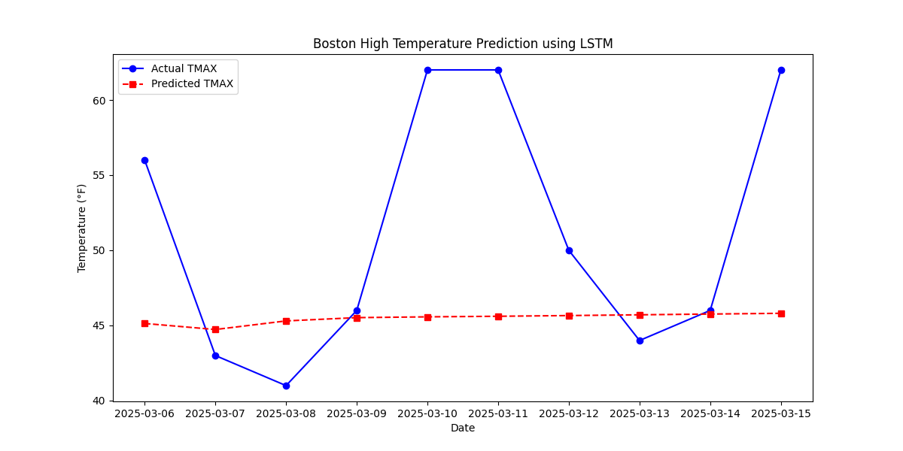

## Simple Sine Predictor

The code for this config can be found in **Simple\SimplePredictor_Training.py**

This predictor is a sine-based model that uses a sine function to capture periodic patterns in data. It is particularly useful for datasets that exhibit seasonal or cyclical trends, which works for our task of high temperature prediction.

One of the benefits of this model is that its lightweight and is quick to train. 

Here is how the forward pass to calculate TMAX is done:
    
    TMAX = sin(w*t + d ) + b
    t is the day of the year
    w is the frequency
    d is the phase shift 
    b is the bias

When we first ran this experiment, we ran it using MinMax scalar for TMAX to normalize our TMAX values to be between 0 and 1. After testing 24 different configurations, the best performing one (based on Test MSE) is shown below where the learning rate is 0.01 and epochs is 5000.

Here is how it performs on the training data. As expected it creates sine waves due to the seasonal patterns.

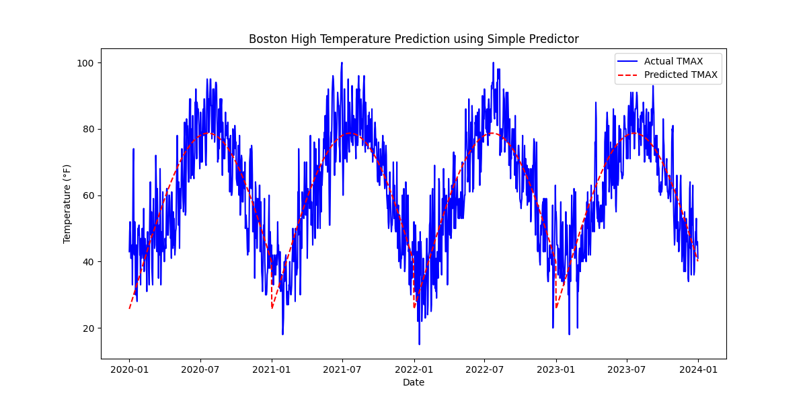

Here is how it performs on the testing data. It appears to be a somewhat linear estimation as it expects a temperature increase from January to March.

**Test MSE**: 79.76174

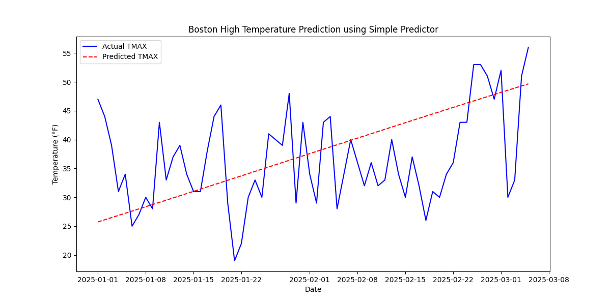

We also changed the scalar to be a StandardScaler. This normalize the TMAX value by transforming it to have a mean of 0 and a standard deviation of 1.
After testing 24 different configurations, the best performing one (based on Test MSE) is shown below where the learning rate is 0.01 and epochs is 700.

Here is how it performs on the training data. As expected it creates sine waves due to the seasonal patterns.

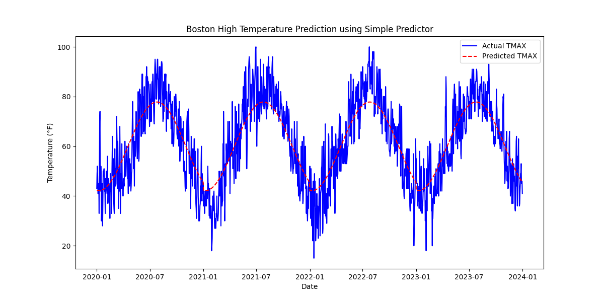

Here is how it performs on the testing data. This is an increasing but smoother curve than the linear one with the MinMax scaler.
**Test MSE**: 112.629196

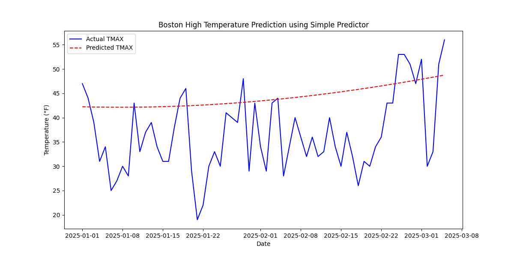

## Vanilla RNN

The code for this config can be found in **VanillaRNN/RNN_InitialTraining.py**

This Vanilla RNN predicts the daily temperature highs using a simple RNN. It learns directly from past temperature sequences to make predictions. 

We first performed an experiment to find the most optimal configuration. After testing 36 different configurations, the best performing one (based on Test MSE) is shown below where:

Features = TMAX, AWND, TAVG, TMIN, WT01, WT02, WT03, WT04, WT05, WT06, WT08, WT0

Sequence Length = 10, Hidden Size = 50, Epochs = 200, Learning Rate = 0.001

**Testing MSE:** 4.17418967786635 (uses scaled data to perform this)

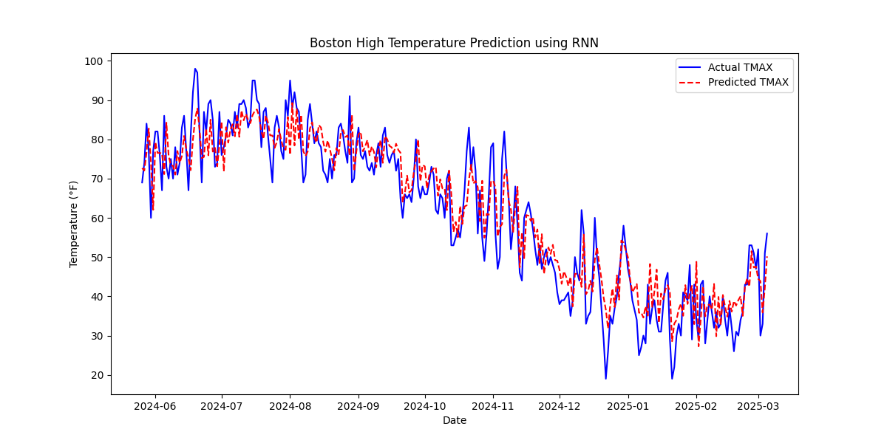

## Experimentations on Data Collected After Models were Trained
### Test Accuracy of Model on 10 days of Data Collected After Model Trained
Data used to initially train/test the model was from 1/1/2020 to 3/5/2025.

To see how the model does on data collected after training, as of right now the **post-training weather data is from 3/6/2025 to 3/15/2025**. Please note, there is a delay in which this type of data (Global Historical Climatology Network - Daily (GHCN-Daily)) is available. For example I downloaded all the data on 3/18 and only got data up to 3/15.

For March 3/6-3/15, the actual temperature high was **[56, 43, 41, 46, 62, 62, 50, 44, 46, 62]**

### Summary
Here is a brief overview of the performance on predicting weather data for this time frame. One thing to note is that the autoregressors are given no actual temperature maxs for this time frame unlike the other models.

As we can see, the LSTM performs the best with the simple RNN in second.

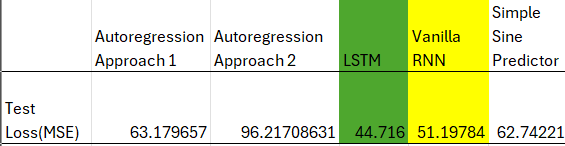

### LSTM Performance
The model used for this is the best performing model from the second experiment. The exact configuration can be found in **LSTM/LSTM_Recent_Data_Experiment.py**.

The LSTM model predicted: 
**[51.23052515, 44.00433891, 48.94897811, 47.24197797, 50.17508112, 57.72638156, 54.70314329, 51.4780312, 50.07089324, 51.70568839]**

Thus, resulting in a **44.71634010811393 test loss (MSE)**. 

The image below displays the actual temperature max vs the predicted temperature max. This model does a good job at estimating temperature max except on days with large outliers.

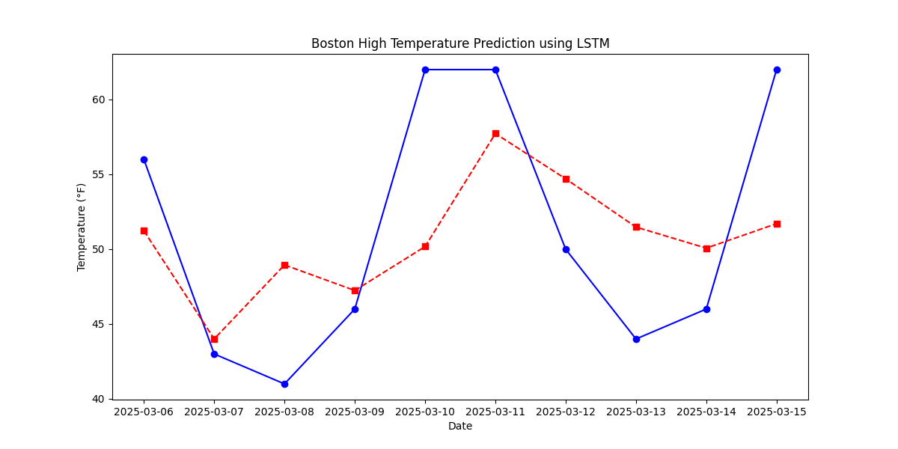

 ### Simple Predictor Performance
The model configuration can be found in **Simple/SimplePredictor_On_Recent_Data.py**. It is the best performing model from the original training discussed above for MinMax Scalar.

The Simple Sine Predictor model predicted: 
**[49.996452, 50.359135, 50.720673, 51.081024, 51.440166, 51.79807, 52.154705, 52.510036, 52.864044, 53.216698]** 

Thus, resulting in a **62.74224 Test MSE Loss**. 

The image below displays the actual temperature max vs the predicted temperature max. As we can see, the model expects a linear increase in temperature as the season typically becomes warmer in March.

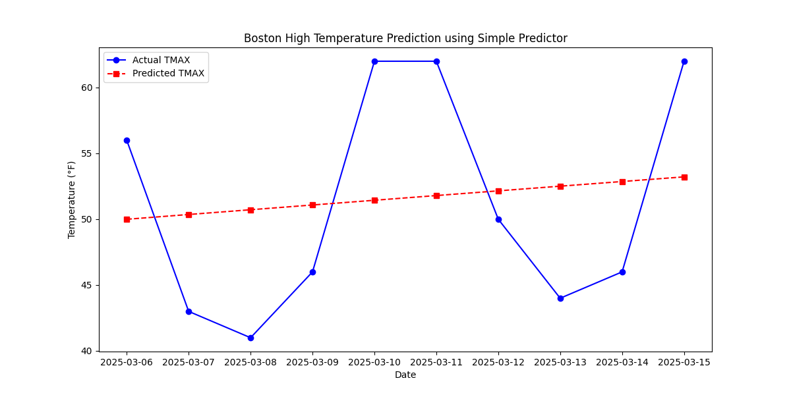

 ### Vanilla RNN Performance
The model configuration can be found in **RNN/RNN_Recent_Data.py**. It is the best performing model from the original training discussed above.

The Vanilla RNN model predicted: 
**[49.64383606, 45.21223836, 48.19776475, 47.8359545, 49.85394388, 55.8692814, 55.55466399, 53.13475814, 52.20869431, 53.42406765]** 

Thus, resulting in a **51.1978353763502 test loss (MSE)**. 

The image below displays the actual temperature max vs the predicted temperature max. Once again, the model does well except for days with large temperature changes.

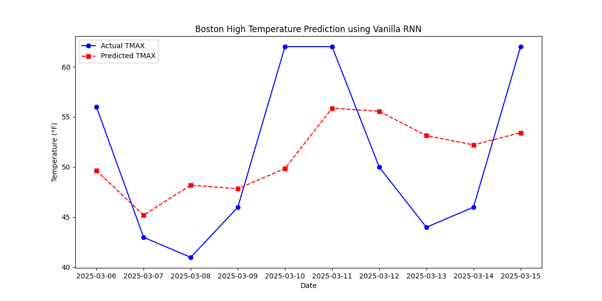
